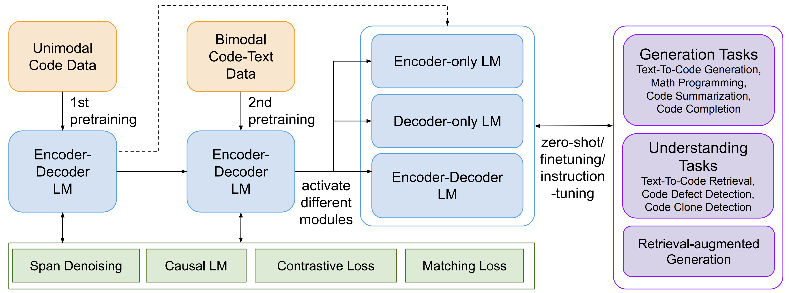

# CodeT5+

Official research release for the **CodeT5+** models (`220M`, `770M`, `2B`, `6B` `16B`) for a wide range of **Code Understanding and Generation** tasks.

*Title*: [CodeT5+: Open Code Large Language Models for Code Understanding and Generation](https://arxiv.org/pdf/2305.07922.pdf)

*Authors*: [Yue Wang](https://yuewang-cuhk.github.io/)\*, [Hung Le](https://sites.google.com/view/henryle2018/home?pli=1)\*, [Akhilesh Deepak Gotmare](https://akhileshgotmare.github.io/), [Nghi D.Q. Bui](https://bdqnghi.github.io/), [Junnan Li](https://sites.google.com/site/junnanlics), [Steven C.H. Hoi](https://sites.google.com/view/stevenhoi/home) (* indicates equal contribution)

# What is this about?
CodeT5+ is a new family of open code large language models with an encoder-decoder architecture that can flexibly operate in different modes (i.e. _encoder-only_, _decoder-only_, and _encoder-decoder_) to support a wide range of code understanding and generation tasks.
See the below overview of CodeT5+.


To train CodeT5+, we introduce a diverse set of pretraining tasks including _span denoising_, _causal language modeling_, _contrastive learning_, and _text-code matching_ to learn rich representations from both unimodal code data and bimodal code-text data. 
Additionally, to efficiently scale up the model, we propose a simple yet effective _compute-efficient pretraining_ method to initialize our model with frozen off-the-shelf LLMs such as [CodeGen](https://github.com/salesforce/CodeGen). 
Furthermore, we explore instruction tuning to align the model with natural language instructions following [Code Alpaca](https://github.com/sahil280114/codealpaca). 


We implemented a family of CodeT5+ models, with model size ranging from 220M to 16B. 
Note that CodeT5+ `220M` and `770M` employ the same architecture of CodeT5-base and large respectively and are pretrained from scratch, while CodeT5+ `2B`, `6B`, `16B` employ a "_shallow encoder and deep decoder_" architecture with the shallow encoder initialized from CodeGen-mono 350M and the deep decoder initialized from CodeGen-mono 2B, 6B, 16B, respectively.
InstructCodeT5+ 16B is our instruction-tuned model from CodeT5+ 16B. 


# Released Models
We release the following CodeT5+ models at Huggingface:

* CodeT5+ `220M` and `770M`: [Salesforce/codet5p-220m](https://huggingface.co/Salesforce/codet5p-220m) and [codet5p-770m](https://huggingface.co/Salesforce/codet5p-770m).
* CodeT5+ `220M` and `770M` that are further tuned on Python subset: [codet5p-220m-py](https://huggingface.co/Salesforce/codet5p-220m-py) and [codet5p-770m-py](https://huggingface.co/Salesforce/codet5p-770m-py).
* CodeT5+ `2B`, `6B`, `16B`: [Salesforce/codet5p-2b](https://huggingface.co/Salesforce/codet5p-2b), [Salesforce/codet5p-6b](https://huggingface.co/Salesforce/codet5p-6b), and [Salesforce/codet5p-16b](https://huggingface.co/Salesforce/codet5p-16b).
* InstructCodeT5+ `16B`: [Salesforce/instructcodet5p-16b](https://huggingface.co/Salesforce/instructcodet5p-16b).

# How to Use?
All CodeT5+ models and tokenizers can be easily loaded using the `AutoModelForSeq2SeqLM` and `AutoTokenizer` functionality. 
For tokenizers, CodeT5+ `220M` and `770M` employ the same tokenizer as the original [CodeT5](https://github.com/salesforce/CodeT5) while CodeT5+ `2B`, `6B`, `16B` employ the same tokenizer as [CodeGen]( https://github.com/salesforce/CodeGen).
To load CodeT5+ `2B`, `6B`, `16B`, please set `trust_remote_code=True` as the [model class](https://huggingface.co/Salesforce/codet5p-16b/blob/main/modeling_codet5p.py) is defined in the Huggingface repo.


```python
from transformers import AutoModelForSeq2SeqLM, AutoTokenizer
import torch

checkpoint = "Salesforce/instructcodet5p-16b"
device = "cuda" # for GPU usage or "cpu" for CPU usage

tokenizer = AutoTokenizer.from_pretrained(checkpoint)
model = AutoModelForSeq2SeqLM.from_pretrained(checkpoint,
                                              torch_dtype=torch.float16,
                                              low_cpu_mem_usage=True,
                                              trust_remote_code=True).to(device)

inputs = tokenizer.encode("def print_hello():", return_tensors="pt").to(device)
outputs = model.generate(inputs, max_length=12)
print(tokenizer.decode(outputs[0], skip_special_tokens=True))

```

# Reproduce the Results

## HumanEval

TBA

## Citation

```bibtex
@article{wang2023codet5plus,
  title={CodeT5+: Open Code Large Language Models for Code Understanding and Generation},
  author={Wang, Yue and Le, Hung and Gotmare, Akhilesh Deepak and Bui, Nghi D.Q. and Li, Junnan and Hoi, Steven C. H.},
  journal={arXiv preprint},
  year={2023}
}
```